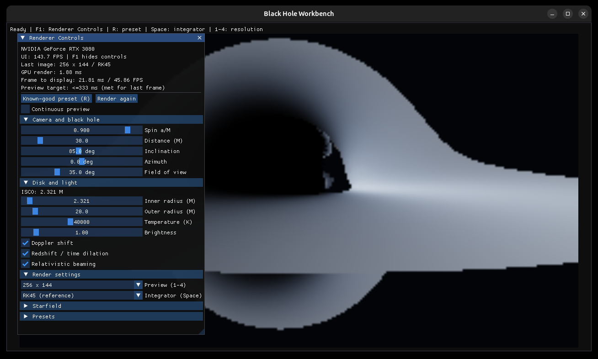
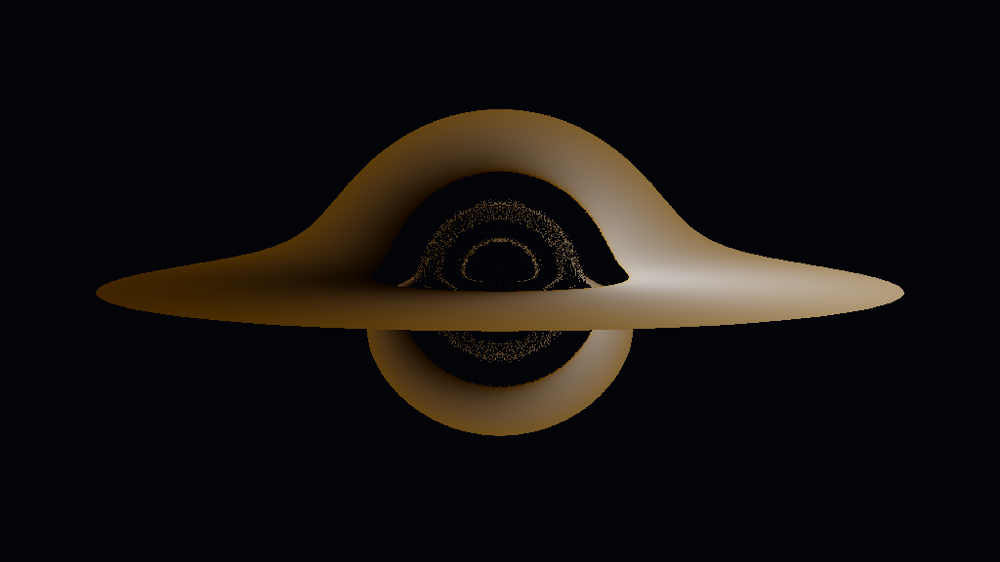

# Black Hole Renderer

CUDA Kerr black-hole renderer with a headless PNG CLI and an SDL2/OpenGL/Dear
ImGui workbench. Both applications use the same render kernel.

**0.9.0-rc.1 is a development release candidate, not a published v1.0.** RK45
is the reference/default integrator. Geokerr is an experimental approximate
alternative; see [validation](docs/VALIDATION.md) for its validation scope.



## Quick start

The supported target is Linux x86_64 with an NVIDIA GPU. A source build needs:

- CMake 3.25+, Ninja, Git, and a C++17 compiler supported by the selected CUDA
  toolkit;
- CUDA Toolkit 12.x (`nvcc`) plus a driver new enough for its CUDA runtime;
- initialized pinned Git submodules;
- for the workbench, SDL2 development files with a CMake config package, OpenGL
  3.3, and a working graphical display.

Clone with submodules, then configure to an explicit cache directory. The
candidate defaults to CUDA architecture 86 (RTX 30 series); set the architecture
appropriate for your GPU.

```bash
git clone --recurse-submodules https://github.com/Blakethefn/blackhole-renderer.git
cd blackhole-renderer

cmake --preset linux-release -B "$HOME/.cache/blackhole-renderer/release" \
  -DCMAKE_CUDA_ARCHITECTURES=86 \
  -DCMAKE_PREFIX_PATH=/optional/path/to/sdl2
cmake --build "$HOME/.cache/blackhole-renderer/release" -j
ctest --test-dir "$HOME/.cache/blackhole-renderer/release" --output-on-failure
```

`setup.sh` is a checked equivalent that never installs system packages, contains
no workstation-specific path, and does not create or repair `build/`:

```bash
./setup.sh --build-dir "$HOME/.cache/blackhole-renderer/release" \
  --cuda-arch 86 --sdl-prefix /optional/path/to/sdl2 --test
```

Use `./setup.sh --help` for the headless, CPU-test, and package modes.

### Headless CUDA build

The CLI and renderer benchmark do not require SDL2, OpenGL, or a display. They
still require a CUDA toolkit to build and an NVIDIA GPU/runtime to render.

```bash
cmake --preset linux-headless -B "$HOME/.cache/blackhole-renderer/headless" \
  -DCMAKE_CUDA_ARCHITECTURES=86
cmake --build "$HOME/.cache/blackhole-renderer/headless" -j
ctest --test-dir "$HOME/.cache/blackhole-renderer/headless" --output-on-failure
```

To use vcpkg, set `VCPKG_ROOT` before configuration or explicitly pass
`-DCMAKE_TOOLCHAIN_FILE=/path/to/vcpkg/scripts/buildsystems/vcpkg.cmake`.
Neither route is required when SDL2 is already discoverable.

## Install and package

Install into a dedicated prefix, then run from outside the source tree:

```bash
cmake --install "$HOME/.cache/blackhole-renderer/release" \
  --prefix "$HOME/.local/opt/blackhole-renderer-0.9.0-rc.1"

PREFIX="$HOME/.local/opt/blackhole-renderer-0.9.0-rc.1"
cd /tmp
"$PREFIX/bin/blackhole-cli" \
  --params "$PREFIX/share/blackhole-renderer/presets/reference.json" \
  --resolution 512x288 --output blackhole.png
```

The install includes binaries, presets, gallery images, documentation, the MIT
license, and third-party notices. It intentionally does not install a C++ SDK:
the source headers describe usable contracts, but this candidate does not
promise a stable ABI or supported standalone library package.

For the cleanest uninstall, use a dedicated prefix and remove that exact prefix.
For a shared prefix, inspect `BUILD/install_manifest.txt` and remove only those
listed files. There is no automatic uninstall target.

Create a checksummed archive locally:

```bash
cpack --config "$HOME/.cache/blackhole-renderer/release/CPackConfig.cmake"
```

The GUI artifact is named
`blackhole-renderer-0.9.0-rc.1-linux-x86_64-cuda12-sm86.tar.gz`; the headless
variant includes `-headless`. CPack writes a matching `.sha256` file. These are
not universal static binaries. The local candidate dynamically requires
`libcudart.so.12`, glibc, libstdc++, libm, libgcc, and the system loader; GUI use
also needs a working NVIDIA OpenGL stack and display. SDL2 linkage follows the
SDL2 package selected at build time. NVIDIA and system libraries are not bundled.
The local artifact was built on Ubuntu 24.04.4 with glibc 2.39; compatibility
with older Linux distributions has not been established.

## Run the CLI

```bash
BUILD="$HOME/.cache/blackhole-renderer/release"

"$BUILD/app/blackhole-cli" --resolution 512x288 --output schwarzschild.png
"$BUILD/app/blackhole-cli" --params presets/reference.json --output kerr.png
"$BUILD/app/blackhole-cli" --params presets/reference.json \
  --resolution 1024x576 --no-beaming --output no-beaming.png
"$BUILD/app/blackhole-cli" --params presets/reference.json \
  --starfield /path/to/stars.exr --output stars.png
```

Use `--help` for the complete option list. Explicit options override a preset
regardless of where `--params` appears; repeated explicit options apply in
command order. Malformed numbers, invalid scenes, missing assets, and failed
renders return nonzero. PNG is the supported output format.

Presets use the strict version-1 JSON schema documented in
[`bhr/presets.hpp`](lib/include/bhr/presets.hpp). Every scene field is saved,
including effect toggles and resolution. External starfield paths are supplied
separately. Preset loading is transactional and validated before replacing the
active scene.

## Deterministic shots

One cinematic JSON document shares a physical scene between fixed-camera and
smooth orbit shots. Render any selected frame with `--shot-file FILE --shot-id ID
--frame INDEX --output FILE.png`. See [scene/shot schema and examples](docs/SHOTS.md).
Disk emission is static in this foundation; animation and video export are deferred.

## Cinematic appearance (Plan 8)

Plan 8 adds an additive cinematic v2 document and CUDA radiance/display path without
changing legacy presets, cinematic v1 documents, or legacy rendering. It uses
float32 linear-sRGB/D65 relative radiance, fixed exposure, optional bounded bloom,
Reinhard RGB, and one sRGB encode into RGBA8. The bundled starfield is deterministic
and original; no sky is downloaded at runtime. See the versioned [appearance
contract](docs/CINEMATIC_APPEARANCE.md) and browse the [actual CUDA stills](docs/plan8-review/stills/index.html).

Selected cinematic frames remain additive to the existing shot invocation:

```bash
"$BUILD/app/blackhole-cli" --shot-file presets/cinematic/scene.json \
  --shot-id fixed --frame 0 --output cinematic.png
```

The workbench accepts the same selected-frame startup inputs:

```bash
"$BUILD/app/blackhole-workbench" --shot-file presets/cinematic/scene.json \
  --shot-id orbit --frame 300
```

The design direction was approved on 2026-09-07. Final user visual acceptance is
still pending; Plan 8 is not claimed complete.

## Workbench

```bash
"$HOME/.cache/blackhole-renderer/release/app/blackhole-workbench"
```

The rendered image fills the window. **F1** shows or hides the floating Renderer
Controls without hiding the completed image.

- Camera distance, inclination, azimuth, field of view, and prograde spin.
- Disk radii, temperature, brightness, Doppler, redshift/time dilation, and
  beaming controls. Spin edits raise the inner radius to ISCO when needed.
- Preview sizes from 256×144 through 1920×1080.
- RK45 or explicitly labeled approximate geokerr integration.
- Explicit HDR EXR starfield loading and strict JSON preset save/load by path.
- Known-good preset, explicit rerender, and optional continuous preview.

Keyboard shortcuts:

| Key | Action |
|---|---|
| F1 | Toggle Renderer Controls |
| R | Reset to the known-good scene |
| Space | Switch RK45/geokerr |
| 1–4 | Select preview resolution |
| Esc | Quit |

Scene shortcuts respect text-entry focus; F1 always toggles controls. Invalid
changes report a reason and retain the last completed image. A preset requesting
a starfield waits for that asset or for starfield sampling to be disabled.

Rendering occurs when the scene changes or continuous preview is enabled. The
UI separately reports kernel time, completed presentation time, and UI FPS.

## Gallery

Every image below is a real 1024×576 RK45 render produced by the adjacent strict
JSON preset with no downloaded starfield.

[](presets/gallery/schwarzschild.json)

[](presets/gallery/kerr-moderate.json)

[](presets/gallery/kerr-high-prograde.json)

Commands and scene details are in the [gallery record](docs/gallery/README.md).
Retrograde spin is not currently supported and is intentionally absent.

## Architecture and API

`bhr::render_device(params, starfield, pixels, capacity_bytes, stream)` validates
and asynchronously launches into caller-owned packed RGBA8 CUDA memory. It does
not allocate, synchronize, or copy pixels. The caller retains the mapped buffer,
stream, and starfield until completion and checks asynchronous execution errors.

The blocking `bhr::render(params, Image&)` wrappers use the same kernel and copy
to host. The workbench owns a persistent CUDA-mapped PBO, two alternating OpenGL
textures, a CUDA event, and GL fences. It presents the previous completed texture
while another frame renders, with no steady-state allocation or GPU-to-CPU copy.

See [Public API contracts](docs/PUBLIC_API.md) and the headers under
[`lib/include/bhr`](lib/include/bhr/).

## Tests and CI

A standard CPU-only machine can run math, validation, image, preset, scene/shot,
CLI parsing, and workbench-state contracts without configuring CUDA:

```bash
cmake --workflow --preset cpu-ci
```

The full suite adds real CUDA rendering, golden/PSNR gates, CLI processes,
starfield ownership, and optional CUDA/OpenGL presentation. Current local status
is documented in [Validation](docs/VALIDATION.md). Skipped presentation is
reported as skipped, not a GPU pass.

GitHub Actions definitions are prepared locally:

- `cpu-contracts.yml` runs the CUDA-free suite on hosted Ubuntu.
- `gpu-validation.yml` is manual and requires labeled self-hosted NVIDIA and
  NVIDIA/OpenGL runners. It does not assume hosted runners have a GPU/display.

The action revisions are pinned by immutable commit SHA. No runner, secret,
external workflow, tag, or release has been created as part of this candidate.

## Measured preview performance

Plan 5 measured the reference preset on 2026-09-05 with Release/sm_86, CUDA
12.0.140, driver 595.58.03, SDL2 2.32.10, and an RTX 3080 12 GB. A hidden
1280×720 SDL/OpenGL/ImGui window was paced at 60 Hz; two warmups preceded ten
frames. Times run through completed texture publication and exclude monitor
scanout. They are not renderer-only FPS.

| Integrator | Source resolution | Mean completed preview | Completed previews/s |
|---|---:|---:|---:|
| RK45 | 1024×576 | 50.163 ms | 19.935 |
| geokerr | 1024×576 | 112.030 ms | 8.926 |

The Plan 6 center-ray correction does not affect this even-sized reference scene,
so these dated measurements were not rerun. Full methods and renderer-only
numbers are in [benchmarks](benchmarks/README.md).

## Known limitations

- Geokerr remains approximate: radial inversion and disk/escape locations can
  differ from RK45 even where the validated hit classification agrees. It is
  not an exact physics mode.
- Disk emission is simplified; blackbody RGB clamps above 40000 K. The diagnostic
  redshift/Doppler split and beaming approximation are documented in
  [`redshift.hpp`](lib/include/bhr/redshift.hpp).
- Starfield EXR support is limited to explicit single-part scanline HALF/FLOAT RGB
  input. Loading and upload are synchronous; no external starfield is bundled.
- Linux x86_64 + NVIDIA CUDA is the only implemented release target. Windows,
  macOS, CPU rendering, Blender integration, animation, EXR output, and native
  file dialogs are not included.
- CUDA sanitizer has not completed instrumentation in the verified environment.
  Ordinary test success is not presented as a sanitizer pass.

## Troubleshooting

- **SDL2 not found:** pass `-DCMAKE_PREFIX_PATH` to a prefix containing
  `SDL2Config.cmake`, use a vcpkg toolchain, or choose `linux-headless`.
- **Unsupported host compiler:** select a compiler supported by your CUDA toolkit,
  for example `-DCMAKE_C_COMPILER=/usr/bin/gcc-12
  -DCMAKE_CXX_COMPILER=/usr/bin/g++-12
  -DCMAKE_CUDA_HOST_COMPILER=/usr/bin/g++-12` for the verified CUDA 12.0 setup.
- **No kernel image / invalid device function:** rebuild with the compute
  capability for your GPU via `-DCMAKE_CUDA_ARCHITECTURES=NN`.
- **Driver/runtime error:** install a driver compatible with the selected CUDA
  runtime. The archive does not carry a driver or `libcudart.so.12`.
- **Workbench display or interop failure:** verify OpenGL 3.3, the active display,
  and that CUDA and OpenGL use the same NVIDIA GPU. Headless rendering does not
  require a display.
- **Missing vendored headers:** run `git submodule update --init --recursive`.

## Project policy

Contributions follow [CONTRIBUTING](CONTRIBUTING.md) and the
[Code of Conduct](CODE_OF_CONDUCT.md). Third-party attributions are in
[THIRD_PARTY_NOTICES](THIRD_PARTY_NOTICES.md). The project remains MIT licensed;
copyright is held by Blake Paulson.

Physics references include James et al. (2015), Dexter & Agol (2009), Chan et
al. (2013), and Bardeen, Press & Teukolsky (1972). If you publish scientific
work based on these renders, cite the methods you actually rely on and disclose
the approximations above.
