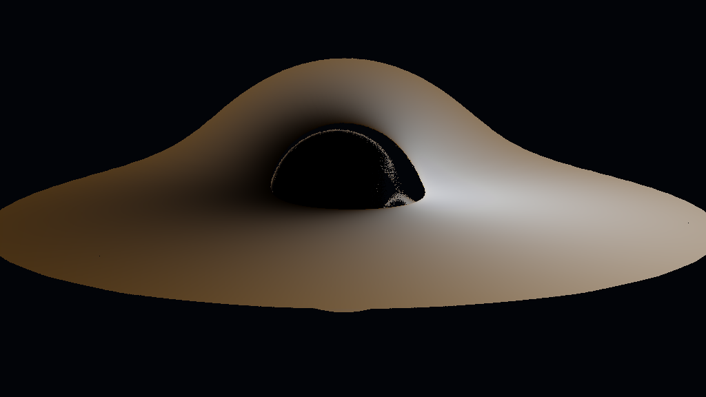
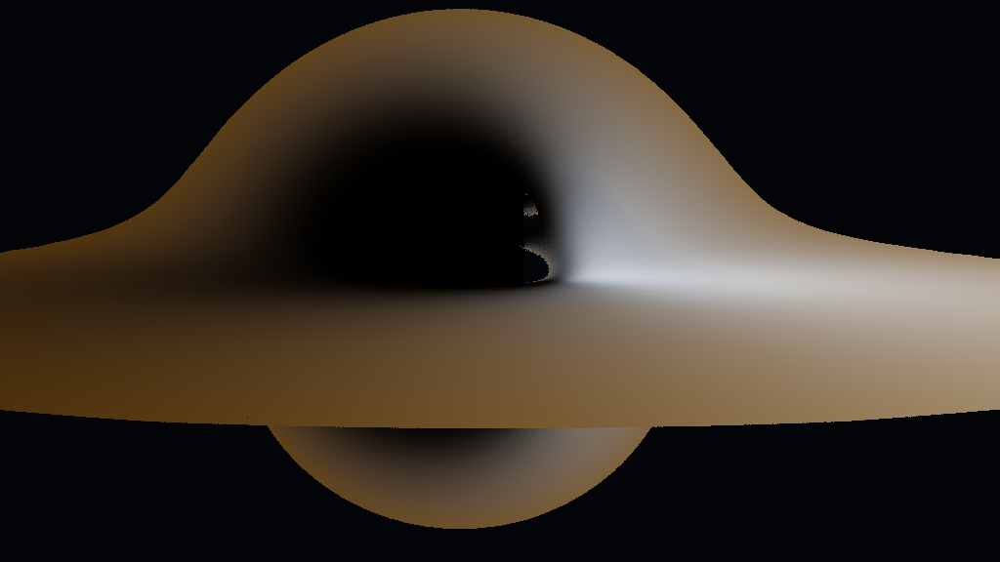

# Renderer gallery

These images were rendered locally by `blackhole-cli` from the committed strict
JSON presets. They use RK45, no external starfield, and supported prograde spin.
They are evidence of renderer output, not astrophysical validation.

| Scene | Preset | Command |
|---|---|---|
| Schwarzschild | `presets/gallery/schwarzschild.json` | `blackhole-cli --params presets/gallery/schwarzschild.json --output gallery/schwarzschild.png` |
| Moderate Kerr, spin 0.5 | `presets/gallery/kerr-moderate.json` | `blackhole-cli --params presets/gallery/kerr-moderate.json --output gallery/kerr-moderate.png` |
| High prograde Kerr, spin 0.99 | `presets/gallery/kerr-high-prograde.json` | `blackhole-cli --params presets/gallery/kerr-high-prograde.json --output gallery/kerr-high-prograde.png` |

The workbench screenshot below was captured from the real Linux CUDA/OpenGL
application with the Renderer Controls panel visible.

